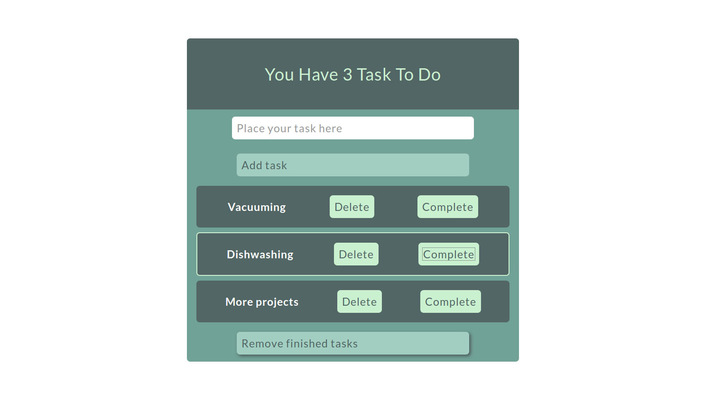

<h1> To-do-list </h1>

<h3> General Information </h3>

 To-do-list created using Vanilla Javascript. 

 https://pmatyjas.github.io/To-do-list/ 

<h3> Technologies </h3>

 JavaScript 

<h3> Screenshot </h3>

